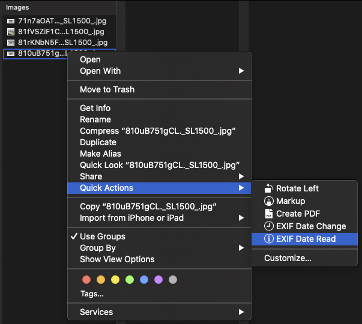
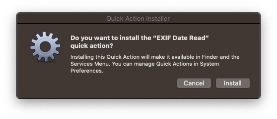
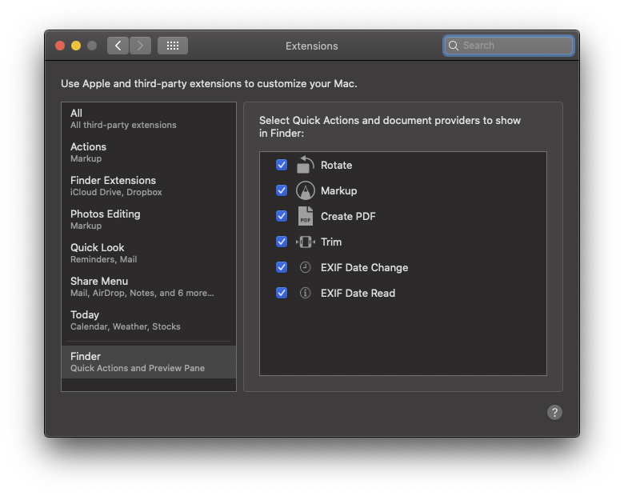
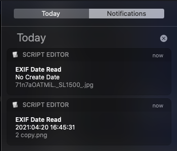

# EXIF Date Read.workflow for macOS

Right click file(s) or folder(s) to perform an EXIF Date Read on one, or many files.



**POSSIBLY USEFUL:** I have also authored an [EXIF Date Change.workflow for macOS](https://github.com/rajannpatel/EXIF-Date-Change.workflow-for-macOS)

---

## Prerequisites

1. Install [homebrew](https://brew.sh/)
1. Install [exiftool](https://exiftool.org/) with homebrew: `brew install exiftool`
1. Users not running macOS 10.15 Catalina will need to install **zsh** with homebrew: `brew install zsh`

## Quickstart

1. download and unzip [EXIF Date Read.workflow.zip](https://github.com/rajannpatel/EXIF-Date-Read.workflow-for-macOS/raw/master/EXIF%20Date%20Read.workflow.zip)
1. open **EXIF Date Read.workflow** with the default application: **Automator Installer.app**
1. right click any folder(s) or file(s) and click **Quick Action** > **EXIF Date Read**

## Installation

### Choose an installation method:

#### Option A: zsh

```zsh
unzip =( curl https://github.com/rajannpatel/EXIF-Date-Read.workflow-for-macOS/raw/master/EXIF%20Date%20Read.workflow.zip -L ) && open EXIF\ Date\ Read.workflow
```

#### Option B: bash

```bash
curl https://github.com/rajannpatel/EXIF-Date-Read.workflow-for-macOS/raw/master/EXIF%20Date%20Change.workflow.zip -L -o workflow.zip
unzip workflow.zip
rm workflow.zip
open EXIF\ Date\ Read.workflow
```

Once this installation completes you can remove **EXIF Date Read.workflow** using this command:

```bash
rm -rf EXIF\ Date\ Read.workflow
```

#### Option C: git

```bash
git clone -n git@github.com:rajannpatel/EXIF-Date-Read.workflow-for-macOS.git --depth 1
cd EXIF-Date-Read.workflow-for-macOS
git checkout HEAD "EXIF Date Read.workflow.zip"
unzip "EXIF Date Read.workflow.zip"
open EXIF\ Date\ Read.workflow
```

Once this installation completes you can remove the **EXIF-Date-Read.workflow-for-macOS** directory using this command:

```bash
cd ..
rm -rf EXIF\ Date\ Read.workflow
```

### Approve the installation



### Confirm Installation Succeeded

If you don't see **EXIF Date Read** in **System Preferences** > **Extensions** > **Finder** just like the screenshot below, you may need to run the `open EXIF\ Date\ Read.workflow` command again, or double click it to run it.



## Usage

Using **Finder.app** you can right click on any file(s) or folder(s) with images to read the EXIF Create Date property.

You will see an individual notification for each file in your selection, or for every file the folder(s) you have selected.


The notifications panel will retain a history of your date readings:

